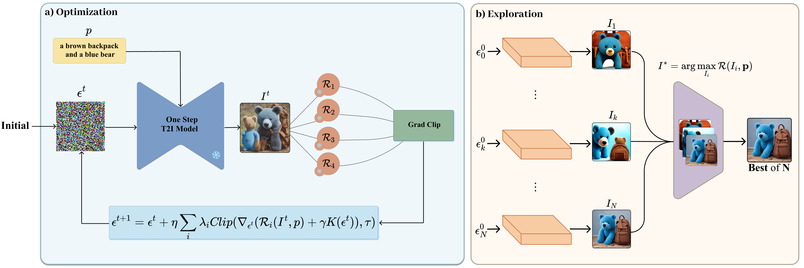

#  **CARINOX**


<!-- __Authors__:  -->

[](#)


### Abstract
Text-to-image diffusion models, such as Stable Diffusion, can produce high-quality and diverse images but often fail to achieve compositional alignment, particularly when prompts describe complex object relationships, attributes, or spatial arrangements. Recent inference-time approaches address this by optimizing or exploring the initial noise under the guidance of reward functions that score text–image alignment—without requiring model fine-tuning. While promising, each strategy has intrinsic limitations when used alone: optimization can stall due to poor initialization or unfavorable search trajectories, whereas exploration may require a prohibitively large number of samples to locate a satisfactory output. Our analysis further shows that neither single reward metrics nor ad-hoc combinations reliably capture all aspects of compositionality, leading to weak or inconsistent guidance. To overcome these challenges, we present <strong>C</strong>ategory-<strong>A</strong>ware <strong>R</strong>eward-based <strong>I</strong>nitial <strong>N</strong>oise <strong>O</strong>ptimization and E<strong>X</strong>ploration (<strong>CARINOX</strong>), a unified framework that combines noise optimization and exploration with a principled reward selection procedure grounded in correlation with human judgments. Evaluations on two complementary benchmarks—covering diverse compositional challenges—show that CARINOX raises average alignment scores by +16% on T2I-CompBench++ and +11% on the HRS benchmark, consistently outperforming state-of-the-art optimization and exploration-based methods across all major categories, while preserving image quality and diversity.


## **Setup**
To install the necessary dependencies, use the provided `environment.yml` file.  
Additionally, run the `hps_installer.py` script to acquire any required assets.

```bash
conda env create -f environment.yml
conda activate carinox
python hps_installer.py
```

## **Usage**
Run `main.py` with various configurations.  

- Put your **prompt files** in the `assets` folder and specify their name in the `--prompt_file` argument.  
- Keep in mind that **DA score** requires [divide-evaluate-and-refine](https://1jsingh.github.io/divide-evaluate-and-refine) question generation using OPENAI.  
  - You can generate your own questions and add them to the DA score assets,  
  - Or simply use the sample prompts already included in `assets`,  
  - Or disable this score altogether if not needed.

```bash
python main.py --model {"sd-turbo" | "sdxl-turbo" | "pixart"} \
               --k <int> \
               [--disable_vqa] [--disable_da] [--disable_hps] [--disable_imagereward] \
               --prompt_file <name_of_prompt_file_in_assets> \
               [--save_all_images] [--no_optim] \
               [--cache_dir <path>] [--save_dir <path>] \
               [--lr <float>] [--n_iters <int>] [--n_inference_steps <int>] \
               [--optim {sgd | adam | lbfgs}] [--grad_clip <float>] \
               [--hps_weight <float>] [--imagereward_weight <float>] \
               [--vqa_weight <float>] [--da_weight <float>] \
               [--reg_weight <float>]
```
### **Example Commands**

```bash
python main.py --model "sd-turbo" --prompt_file "example_prompts" --save_all_images
```

```bash
python main.py --model "pixart" --k 3 --lr 5 --save_all_images
```

```bash
python main.py --model "sdxl-turbo" --disable_da --disable_imagereward --hps_weight 3.0 --vqa_weight 0.5 ```
